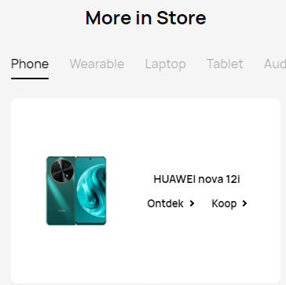
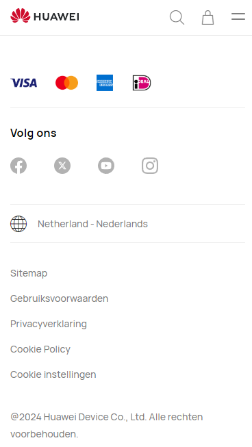
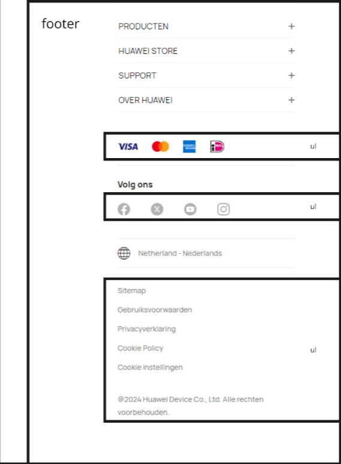

# Procesverslag
Markdown is een simpele manier om HTML te schrijven.  
Markdown cheat cheet: [Hulp bij het schrijven van Markdown](https://github.com/adam-p/markdown-here/wiki/Markdown-Cheatsheet).

Nb. De standaardstructuur en de spartaanse opmaak van de README.md zijn helemaal prima. Het gaat om de inhoud van je procesverslag. Besteedt de tijd voor pracht en praal aan je website.

Nb. Door *open* toe te voegen aan een *details* element kun je deze standaard open zetten. Fijn om dat steeds voor de relevante stuk(ken) te doen.

## Jij

  
uitwerken voor kick-off werkgroep

  ### Auteur:
  Alexi Michielse

  #### Je startniveau:
  Blauw

  #### Je focus:
  Surface plane
 

## Je website

  
uitwerken voor kick-off werkgroep

  ### Je opdracht:
  https://consumer.huawei.com/nl/ 

  #### Screenshot(s) van de eerste pagina (small screen): 
  home screen
  
  
  
  
  

  #### Screenshot(s) van de tweede pagina (small screen):
  Volg je bestelling
  
  
  

## Toegankelijkheidstest 1/2 (week 1)

  
uitwerken na test in 2e werkgroep

  ### Bevindingen
  Lijst met je bevindingen die in de test naar voren kwamen:
  

  postief:
  - duidelijke taal
  - buttons zien eruit als buttuns en linkjes als linkjes
  - gebruikt lang
  - unieke pagina titels
  - a's worden gebruikt

  negatief:
  - errors in de html
  - wel focus alleen, soms niet duidelijk waar je zit
  - niet veel gebruik van ul, waar het wel kan
  - niet alle img hebben een alt
  - veel div's in divs's

## Breakdownschets (week 1)

  
uitwerken na afloop 3e werkgroep

  ### de hele pagina: 
  

  ### dynamisch deel (bijv menu): 
  
  
  

  ### wellicht nog een dynamisch deel (bijv filter): 
  
  

## Voortgang 1 (week 2)

  
uitwerken voor 1e voortgang

  ### Stand van zaken

  het was lastig om dit plaatje in het midden te krijgen, omdat de verhoudingen raar
  waren en de achtergrond wit was, waardoor het dus voor andere elementen ging zitten.
  Ik heb uiteindelijk het plaatje transparant gemaakt en ben daarna met margins gaan spelen
  om hem perfect in het midden te krijgen.

  ### Agenda voor meeting
  samen met je groepje opstellen

  | Alexi          | Ingmar             | Merel        | Lucas      |
  | ---            | ---                | ---          | ---              |
  | dit bespreken  | en dit             | en ik dit    | en dan ik dat    |
  | en dat ook nog | dit als er tijd is | nog een punt | dit wil ik zeker |
  | ...            | ...                | ...          | ...              |

  ### Verslag van meeting
  hier na afloop snel de uitkomsten van de meeting vastleggen

  - Nav aanmaken met ul en li
  - H1 toevoegen in de code 

## Voortgang 2 (week 3)

  
uitwerken voor 2e voortgang

  ### Stand van zaken
  Ik loop een beetje achter dus moet nog even aan de bak

  ### Agenda voor meeting
  samen met je groepje opstellen

  | Alexi      
  | ---           
  | dit bespreken  
  | en dat ook nog 
  | ...            

  ### Verslag van meeting
  hier na afloop snel de uitkomsten van de meeting vastleggen

  - Readme bijwerken
  - H1 andere tekst geven
  

## Toegankelijkheidstest 2/2 (week 4)

  
uitwerken na test in 9e werkgroep

  ### Bevindingen
 positief: 
 - Duidelijke taal, geen vage woorden
 - buttons en linkjes zijn duidelijk zichtbaar en zien er anders uit
 - geen errors in html, css en de console
 - verschillende titel per pagina
 - geen horizontale scrolling
 - buttons kunnen makkelijk geklikt worden
 - 1 H1 element per pagina
 - logische volgorde in h elemten (h1, dan h2, dan h3... etc)
 - images hebben alt tekst waar nodig is
 - screenreader werkt

neagtief:
- website kan hoirzontaal, alleen ziet het er minder uit

## Voortgang 3 (week 4)

  
uitwerken voor 3e voortgang

  ### Stand van zaken
  hier dit ging goed & dit was lastig (neem ook screenshots op van delen van je website en code)

  ### Agenda voor meeting
  samen met je groepje opstellen

  | Alexi    
  | vargen wat er bedoeld wordt met extra surface plane           
  | hamburger menu checken 
  | vragen naar details tag           

  ### Verslag van meeting
  hier na afloop snel de uitkomsten van de meeting vastleggen

  - surface plane dingen toevoegen
  - readme bijwerken
  - beginnen aan 2de pagina

## Eindgesprek (week 5)

  
uitwerken voor eindgesprek

  ### Je uitkomst - karakteristiek screenshots:
  

  ### Dit ging goed/Heb ik geleerd: 
  Korte omschrijving met plaatjes

  

  ### Dit was lastig/Is niet gelukt:
  Korte omschrijving met plaatjes

  

## Bronnenlijst

  
continu bijhouden terwijl je werkt

  Nb. Wees specifiek ('css-tricks' als bron is bijv. niet specifiek genoeg). 
  Nb. ChatGpT en andere AI horen er ook bij.
  Nb. Vermeld de bronnen ook in je code.

  1. chat gpt, prompt: kan jij toevoegen aan deze code, dat als je op het 3de plaatje klikt in de nav, er een hamburger menu 
         opent met de volgende items: Store, Support, 
         Bestelling, Aanmelden. de pagina moet helemaal wit zijn behalve die 
         elementen en de nav moet ook blijven, en als je dan 
         weer op het plaatje klikt dan sluit het hamburger menu zich weer.

  2. Chat gpt, prompt: Hoe kan je een animatie maken 
      dat de lijn onder de li in plaats van 
      instant verplaatst als je op een ander 
      klikt, maar dat hij schuift naar de andere?

  3. David studentassistent

  4. chat gpt, prompt: hoe kan ik een invul plek maken waar je bijvoorbeeld je email ik kan vullen?

  5. hij moet elke keer als 
    je op die knop klikt een van 3 afbeeldingen laten zien, en 
    dan gewoon een random afbeelding kiezen, nu is het als ik erop 
    klik dat de afbeelding wel veranderd, alleen hij doet het maar 1 keer

  6. chat gpt, prompt: hoe kan ik zorgen dat als je op de li laptop klikt, 
     je nog steeds zo een wit vierkant ziet maar dan dat hij iets anders weergeeft? 

  7. chat gpt, prompt: ik probeer de a's onder de h4 naast elkaar te krijgen,
   alleen elke keer als ik ze van plek wil veranderen gaan ze 
   bijvoorbeeld in elkaar zitten ofzo, terwijl ze tegelijk gestijld worden, 
   kan jij de a's naast elkaar onder de h4 krijgen?

  8. https://consumer.huawei.com/nl/

